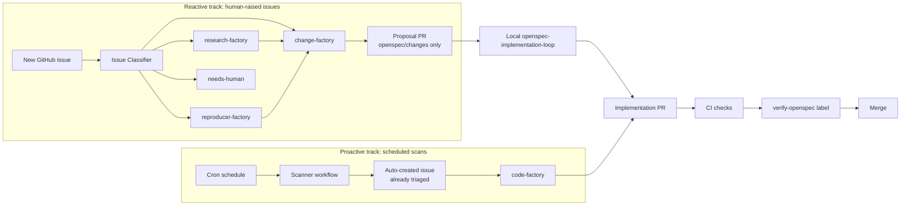

# Agentic development workflow

This page is the high-level map of how work moves through the repository, from a new GitHub issue all the way to a merged PR. It exists because the repo combines two automation systems that meet in the middle:

- **GitHub Agentic Workflows (AWF)** in [`.github/workflows/`](../../.github/workflows/) run in CI. Some react to labels on issues ("factories"); others run on a schedule ("continuous quality"). They produce sticky comments, PRs, or new issues.
- **OpenSpec** under [`openspec/`](../../openspec/) holds the canonical functional requirements. Changes flow through `openspec/changes/<id>/` artifacts (proposal, design, tasks, delta specs) and are applied locally using skills under [`.agents/skills/`](../../.agents/skills/).

Use this page when you want the overall picture. The deeper details live in:

- [`factory-workflows.md`](./factory-workflows.md) — label-triggered factories (`research-factory`, `reproducer-factory`, `change-factory`, `code-factory`) and the issue classifier
- [`continuous-quality-workflows.md`](./continuous-quality-workflows.md) — scheduled scanners that file or fix issues automatically
- [`openspec-workflows.md`](./openspec-workflows.md) — preparing a change, the local implementation loop, and the verify cycle
- [`openspec-requirements.md`](./openspec-requirements.md) — authoring rules for OpenSpec specs themselves
- [`code-review.md`](./code-review.md) — the maintainer view of the `verify-openspec` PR label

## Two tracks

The automation has two distinct entry points:

The reactive track is the canonical path for new features and bugs and goes through OpenSpec. The proactive track is for mechanical quality work — refactors, test coverage gaps, duplicate code, flaky tests — and skips OpenSpec by handing straight to `code-factory`.

## Decision tree: which path applies?

The [issue classifier](./factory-workflows.md#front-door-issue-classifier) makes the first cut by labelling each incoming issue. Use the table below to pick a path once an issue has been classified, or when starting work locally:

| Signal | Path |
|--------|------|
| Brand-new resource, data source, ephemeral, or action | Reactive → research-factory → change-factory → loop |
| Behavioral change to an existing entity needing design discussion | Reactive → change-factory → loop |
| Reproducible bug | Reactive → reproducer-factory → change-factory → loop |
| Bug whose fix is one obvious change with no spec impact | Reactive → code-factory (skip OpenSpec) |
| Refactor, duplicate code, test coverage gap, flaky test | Proactive (or manual `code-factory` apply) |
| Generated-client drift, docs drift, dead code | Direct cleanup workflow (no issue, no OpenSpec) |
| Vague, ambiguous, security, or meta | Stays `needs-human` |

When unsure, prefer the OpenSpec path. It is cheap to write a tiny proposal and expensive to merge an undocumented behavior change.

## Phase labels

Each reactive-track issue carries exactly one `phase-*` label after it has entered a pipeline. The label set and behaviour are documented in [`factory-workflows.md`](./factory-workflows.md#phase-labels) and pinned by the [`ci-factory-pipeline-phase-labels`](../../openspec/specs/ci-factory-pipeline-phase-labels/spec.md) spec.

## Where the boundary sits between CI and your laptop

| Concern | In CI (factory / workflow) | On your laptop (skill) |
|---------|----------------------------|-------------------------|
| Triage a new issue | `issue-classifier` | — |
| Author research notes | `research-factory` | `openspec-explore`, `new-entity-requirements` |
| Confirm a bug reproduces | `reproducer-factory` | — |
| Draft an OpenSpec proposal | `change-factory` | `openspec-propose`, `openspec-new-change`, `existing-entity-requirements` |
| Implement an approved change | `code-factory` (quality / mechanical) | `openspec-implementation-loop`, `openspec-apply-change` |
| Verify implementation before merge | `verify-openspec` label | `openspec-verify-change`, `requirements-verification`, `schema-coverage` |
| Babysit a PR through CI and review | — | `pr-monitoring-loop` |
| Detect duplicate code, refactor opportunities, coverage gaps, flaky tests | Continuous-quality scanners | — |
| Roll up generated client drift into entity follow-ups | `kibana-spec-impact` | — |
| Clean up dead code, docs drift | `ci-deadcode-removal-rotation`, `security-role-docs-drift` | — |

The design intent: CI handles **intake and first-pass automation**; the local loop is the richer implementation-and-review surface where humans (and locally-launched agents) drive the work to merge.

## Reading order for new contributors

1. [`contributing.md`](./contributing.md) — setup and PR expectations
2. [`development-workflow.md`](./development-workflow.md) — typical change loop and make targets
3. [`openspec-workflows.md`](./openspec-workflows.md) — how to take a change through OpenSpec end-to-end
4. [`factory-workflows.md`](./factory-workflows.md) — what each label-triggered factory does
5. [`continuous-quality-workflows.md`](./continuous-quality-workflows.md) — what the scheduled workflows do for you in the background
