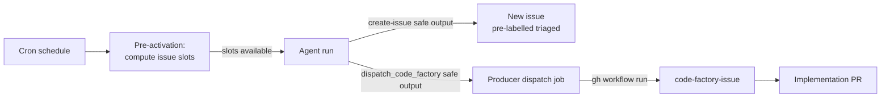

# Continuous quality workflows

This page describes the **scheduled, proactive** agentic workflows that scan the repository on a cron and produce one of three outputs:

- An auto-filed GitHub issue, then a `code-factory` dispatch to implement it.
- An auto-filed issue that waits for a human to triage and pick up.
- A direct cleanup PR with no intermediate issue.

For label-triggered factories that react to human-raised issues, see [`factory-workflows.md`](./factory-workflows.md). For the high-level map, see [`agentic-development-workflow.md`](./agentic-development-workflow.md).

## Index

| Workflow | Schedule | Output type | Source |
|----------|----------|-------------|--------|
| Duplicate Code Detector | Daily | Issue → `code-factory` | [`duplicate-code-detector.md`](../../.github/workflows/duplicate-code-detector.md) |
| Semantic Function Refactor | Daily | Issue → `code-factory` | [`semantic-function-refactor.md`](../../.github/workflows/semantic-function-refactor.md) |
| Schema Coverage Rotation | Daily | Issue → `code-factory` | [`schema-coverage-rotation.md`](../../.github/workflows/schema-coverage-rotation.md) |
| Flaky Test Catcher | Daily | Issue → `code-factory` | [`flaky-test-catcher.md`](../../.github/workflows/flaky-test-catcher.md) |
| Kibana Spec Impact | Weekly Mon + push to `generated/kbapi/**` or `internal/clients/kibanaoapi/**` | Issue (manual handoff) | [`kibana-spec-impact.md`](../../.github/workflows/kibana-spec-impact.md) |
| Dead-code Removal Rotation | Daily | Direct cleanup PR | [`ci-deadcode-removal-rotation.md`](../../.github/workflows/ci-deadcode-removal-rotation.md) |
| Security Role Docs Drift | Weekly Mon + push to `generated/kbapi/**` | Direct cleanup PR | [`security-role-docs-drift.md`](../../.github/workflows/security-role-docs-drift.md) |

## The dispatch chain

Four of the scheduled workflows file issues and immediately dispatch `code-factory` for each one. They share the helper at [`.github/workflows/shared/dispatch-code-factory.md`](../../.github/workflows/shared/dispatch-code-factory.md), which adds a `dispatch-code-factory` safe-outputs job to the workflow. After the agent creates issues via the `create-issue` safe output, that job runs [`producer-dispatch.js`](../../.github/scripts/workflows/lib/producer-dispatch.js) to call `gh workflow run code-factory-issue.lock.yml` once per created issue, passing both `issue_number` and a `source_workflow` provenance tag.

The auto-created issues are pre-labelled `triaged` so the issue classifier skips them. Each scanner also adds a specific topic label (e.g. `duplicate-code`, `semantic-refactor`) used by its slot-cap computation.

## Issue slots: backpressure

Each scanner runs a pre-activation step that counts how many of its own open issues already exist and refuses to create more than the cap. This stops a flaky scan from flooding the issue tracker.

| Scanner | Topic label | Per-run cap | Cap source |
|---------|-------------|-------------|------------|
| Duplicate Code Detector | `duplicate-code` | 3 | `ISSUE_SLOTS_CAP` env var |
| Semantic Function Refactor | `semantic-refactor` | 3 | `ISSUE_SLOTS_CAP` env var |
| Schema Coverage Rotation | `schema-coverage` | 3 | `ISSUE_SLOTS_CAP` env var |
| Flaky Test Catcher | `flaky-test` | computed from CI failures | Pre-activation script |
| Kibana Spec Impact | `kibana`, `generated-clients`, `terraform-provider` | 5 (`issue_cap`) | Pre-activation script |

The three scanners using a fixed `ISSUE_SLOTS_CAP` share the helper at [`.github/scripts/workflows/issue-slots/compute.js`](../../.github/scripts/workflows/issue-slots/compute.js). Flaky Test Catcher computes its own slots in [`.github/scripts/workflows/flaky-test-catcher/catch.js`](../../.github/scripts/workflows/flaky-test-catcher/catch.js) (it needs to weigh CI-failure history in the same step), and Kibana Spec Impact uses the Go pre-activation command at [`scripts/kibana-spec-impact`](../../scripts/kibana-spec-impact). All three paths publish `issue_slots_available`, and the workflow's job-level `if:` short-circuits when it is zero.

## Scanners that hand off to `code-factory`

Each scanner's heuristics, thresholds, and issue body shape live in its workflow source — link only.

- **Duplicate Code Detector** ([source](../../.github/workflows/duplicate-code-detector.md)) — finds duplicated patterns in recently changed Go files (excluding tests and workflow YAML).
- **Semantic Function Refactor** ([source](../../.github/workflows/semantic-function-refactor.md)) — Serena + gopls analysis across non-test `.go` files; flags misplaced functions, near-duplicates, scattered helpers, and extraction or generics opportunities.
- **Schema Coverage Rotation** ([source](../../.github/workflows/schema-coverage-rotation.md), skill: [`schema-coverage`](../../.agents/skills/schema-coverage/SKILL.md)) — rotates coverage analysis across Terraform entities by least-recently-analysed; persists rotation state in a [repo-memory branch](#repo-memory-branches).
- **Flaky Test Catcher** ([source](../../.github/workflows/flaky-test-catcher.md), skill: [`flaky-test-catcher`](../../.agents/skills/flaky-test-catcher/SKILL.md)) — inspects recent `test.yml` failures on `main`, classifies by fail-rate, deduplicates against open `flaky-test` issues.

## Scanners that file issues for human handoff

- **Kibana Spec Impact** ([source](../../.github/workflows/kibana-spec-impact.md)) — diffs generated `kbapi` symbols against a baseline in the [repo-memory branch](#repo-memory-branches) and maps high-confidence changes to impacted Terraform entities. Does **not** dispatch `code-factory`; maintainer triages and decides between `change-factory` and `code-factory`.

## Workflows that open cleanup PRs directly

- **Dead-code Removal Rotation** ([source](../../.github/workflows/ci-deadcode-removal-rotation.md)) — picks one dead-code candidate per run from a deterministic rotation with cooldown, verifies with `make build` + unit tests, then opens one cleanup PR.
- **Security Role Docs Drift** ([source](../../.github/workflows/security-role-docs-drift.md)) — diffs `scripts/security-role-docs/kibana-features.json` against the live Kibana features API and regenerates `docs/guides/security-roles.md` when drift exists.

## Repo memory branches

Several scanners persist state on dedicated orphan branches under `memory/` so rotation, dedupe, and baselines survive across runs:

| Branch | Used by | What it stores |
|--------|---------|----------------|
| `memory/schema-coverage-rotation` | Schema Coverage Rotation | Per-entity last-analysed timestamps |
| `memory/ci-deadcode-removal-rotation` | Dead-code Removal Rotation | Candidate attempts, filtered candidates, outcome reasons |
| `memory/kibana-spec-impact` | Kibana Spec Impact | Analysed baseline SHA and per-entity dedupe fingerprints |

Branches are read via the `repo-memory` tool config in each workflow and written either by helper Go programs under `scripts/<rotation-name>/` or by inline `record` invocations the agent runs near the end of its task. The pattern means the next run begins from durable state rather than re-deriving it.

## Manual dispatch

All scheduled workflows declare `workflow_dispatch`. Useful when:

- A scanner is being iterated on and you want an immediate run.
- You want to clear a backlog after a long pause.
- You want to confirm a fix removed a finding before the next cron tick.

Each workflow's pre-activation runs first, so dispatch still honours slot caps, cooldowns, and duplicate-PR suppression.

## Adding a new scanner

When introducing a new scheduled workflow that should hand off to `code-factory`:

1. Import [`shared/dispatch-code-factory.md`](../../.github/workflows/shared/dispatch-code-factory.md) in the workflow's `imports:` list. Do not add a per-workflow `dispatch-code-factory` job.
2. Compute issue slots in pre-activation using the [`issue-slots/compute.js`](../../.github/scripts/workflows/issue-slots/compute.js) helper, with an `ISSUE_SLOTS_LABEL` and `ISSUE_SLOTS_CAP`.
3. Pre-label every created issue `triaged` (the safe-output label list) so the classifier skips it.
4. After creating issues, instruct the agent to call `dispatch_code_factory` once. The shared helper will fan out one `code-factory-issue` dispatch per issue with the `source_workflow` provenance tag.
5. If state must persist across runs, register a `repo-memory` branch under `memory/<workflow-name>`.

For scanners that open their own cleanup PR (no issue), follow the patterns in `ci-deadcode-removal-rotation.md` and `security-role-docs-drift.md` instead.

## See also

- Label-triggered factories (including `code-factory`, which the scanners dispatch to): [`factory-workflows.md`](./factory-workflows.md)
