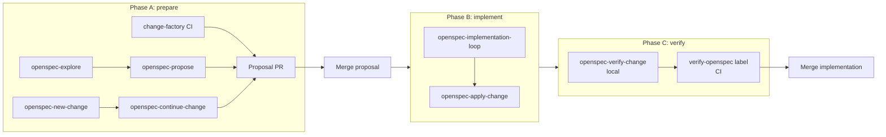

# OpenSpec workflows

This page describes the **operational** loop around OpenSpec changes: how to prepare a change, implement it locally, and run it through verification before merge. For the spec-authoring rules themselves (file layout, requirement phrasing, validation), see [`openspec-requirements.md`](./openspec-requirements.md). For the maintainer view of the `verify-openspec` PR label, see [`code-review.md`](./code-review.md). For the broader picture of how this fits with CI factories, see [`agentic-development-workflow.md`](./agentic-development-workflow.md).

The canonical step-by-step procedures live in skill files under [`.agents/skills/`](../../.agents/skills/) and [`.agents/skills/`](../../.agents/skills/). This page describes **which skill to reach for and when**, not the steps inside each skill.

## Three phases

## Phase A — Prepare the change

Goal: an approved change directory under `openspec/changes/<change-id>/` containing at least `proposal.md`, `design.md`, `tasks.md`, and delta specs.

### Local skills

| Skill | When to use |
|-------|-------------|
| [`openspec-explore`](../../.agents/skills/openspec-explore/SKILL.md) | Scope is fuzzy; you want to investigate the codebase, compare approaches, or clarify requirements **without** committing to artifacts yet |
| [`openspec-propose`](../../.agents/skills/openspec-propose/SKILL.md) | You can describe the desired outcome in one pass and want all artifacts generated together |
| [`openspec-new-change`](../../.agents/skills/openspec-new-change/SKILL.md) | You want to scaffold the change directory first and then add artifacts incrementally |
| [`openspec-continue-change`](../../.agents/skills/openspec-continue-change/SKILL.md) | A change exists but is not yet apply-ready; create the next artifact in sequence |
| [`new-entity-requirements`](../../.agents/skills/new-entity-requirements/SKILL.md) | Drafting a brand-new resource, data source, ephemeral, or action from an API spec |
| [`existing-entity-requirements`](../../.agents/skills/existing-entity-requirements/SKILL.md) | Capturing the behaviour of an entity that already exists in code |

### CI alternative

For reactive-track work (an issue labelled `change-factory`), the [`change-factory`](./factory-workflows.md#change-factory--openspec-proposal-authoring) workflow drafts the same artifacts in CI and opens the proposal PR. The local skills and the CI workflow produce the same shape of output; pick whichever fits the situation.

### Proposal PR

Send the OpenSpec artifacts for review **before implementation**. The proposal PR should contain only files under `openspec/changes/<change-id>/`. This is the point to resolve scope, requirements, and design questions while the cost of change is still low.

## Phase B — Implement the change

Goal: provider code, tests, and any related generated artifacts that satisfy every task and requirement in the approved change.

### Local skills

| Skill | When to use |
|-------|-------------|
| [`openspec-apply-change`](../../.agents/skills/openspec-apply-change/SKILL.md) | You are doing the implementation by hand or with light agent help; reads the change, works the task list, ticks checkboxes |
| [`openspec-implementation-loop`](../../.agents/skills/openspec-implementation-loop/SKILL.md) | You want an automated end-to-end loop around a single approved change: implement, review, push, watch CI, optionally drive a PR with review handling |

The implementation loop is the heavier, recommended path for non-trivial work. It triages the change into one of three execution strategies (inline, single-implementor, per-task) based on size and coupling, and asks you up front for a **delivery mode**:

- **Commit-only**: push to origin, watch GitHub Actions on the branch.
- **Pull request**: create a PR after the initial push, then delegate PR monitoring to [`pr-monitoring-loop`](../../.agents/skills/pr-monitoring-loop/SKILL.md).

Strategy thresholds and review cadence are defined in the [`openspec-implementation-loop`](../../.agents/skills/openspec-implementation-loop/SKILL.md) skill itself.

### Validation requirements (all strategies)

The loop always runs at minimum:

- `make lint`
- `make build`
- Targeted acceptance tests with `TF_ACC=1` against a live stack (see [`testing.md`](./testing.md))

For Terraform entity changes it also runs the [`schema-coverage`](../../.agents/skills/schema-coverage/SKILL.md) skill as a coverage review. For non-entity changes it uses `go test -cover` analysis instead.

### What the loop never does

- It never **archives** a change. Archiving is the responsibility of the verify phase.
- It never force-pushes unless you ask.
- It never starts a second change in the same run.

If the implementor blocks or the loop stalls, it pauses and asks rather than guessing.

### CI alternative

For mechanical work filed by a [continuous-quality scanner](./continuous-quality-workflows.md), the [`code-factory`](./factory-workflows.md#code-factory--direct-implementation) workflow implements directly without the OpenSpec phase. That path skips proposal and verify entirely — use it only when there is no spec impact.

## Phase C — Verify before merge

Goal: confirm the implementation matches the approved change artifacts; on success, archive the change so it moves into `openspec/specs/`.

### Local verification

| Skill | When to use |
|-------|-------------|
| [`openspec-verify-change`](../../.agents/skills/openspec-verify-change/SKILL.md) | Run during the implementation loop and before requesting the CI verify label; checks completeness, correctness, and coherence and produces a CRITICAL / WARNING / SUGGESTION report |
| [`requirements-verification`](../../.agents/skills/requirements-verification/SKILL.md) | Analyse a spec for internal consistency and identify test opportunities |
| [`openspec-sync-specs`](../../.agents/skills/openspec-sync-specs/SKILL.md) | Sync delta specs into `openspec/specs/` when the implementation needs the canonical specs updated without archiving the change yet |

### CI verification: `verify-openspec` label

A maintainer (or the PR monitoring loop) applies the `verify-openspec` label to a PR. The workflow selects one active change, verifies it against the implementation, posts exactly one PR review, and on APPROVE for same-repo PRs runs `openspec archive` and pushes the result back to the PR branch.

The maintainer view, including what "approve" implies and when the workflow skips work, is in [`code-review.md`](./code-review.md). The normative behaviour is pinned by the [`ci-aw-openspec-verification`](../../openspec/specs/ci-aw-openspec-verification/spec.md) spec; the implementation lives in [`.github/workflows/openspec-verify-label.md`](../../.github/workflows/openspec-verify-label.md) and follows the same [`openspec-verify-change`](../../.agents/skills/openspec-verify-change/SKILL.md) skill the local verify step uses.

### Verify and the PR monitoring loop

When the implementation loop runs in PR mode it delegates monitoring to [`pr-monitoring-loop`](../../.agents/skills/pr-monitoring-loop/SKILL.md). That skill knows how to opt in to verify-openspec behaviour: it applies the `verify-openspec` label when `requiresOpenspecVerification` is true and only treats the PR as ready when `verifyOpenspec.runState == "approved"` and CI is green. It also handles re-triggering after pushes, because the verify workflow removes its own label as soon as it picks up a PR.

## Local-only variations

The reactive-track end-to-end flow is in [`agentic-development-workflow.md`](./agentic-development-workflow.md#two-tracks). Two common local variations:

- **Maintainer-driven local change** — skip the `change-factory` CI step and use [`openspec-propose`](../../.agents/skills/openspec-propose/SKILL.md) directly. The rest of the loop is unchanged.
- **`code-factory`-only fix** — for mechanical work with no spec impact, skip OpenSpec entirely and go through [`code-factory`](./factory-workflows.md#code-factory--direct-implementation).
