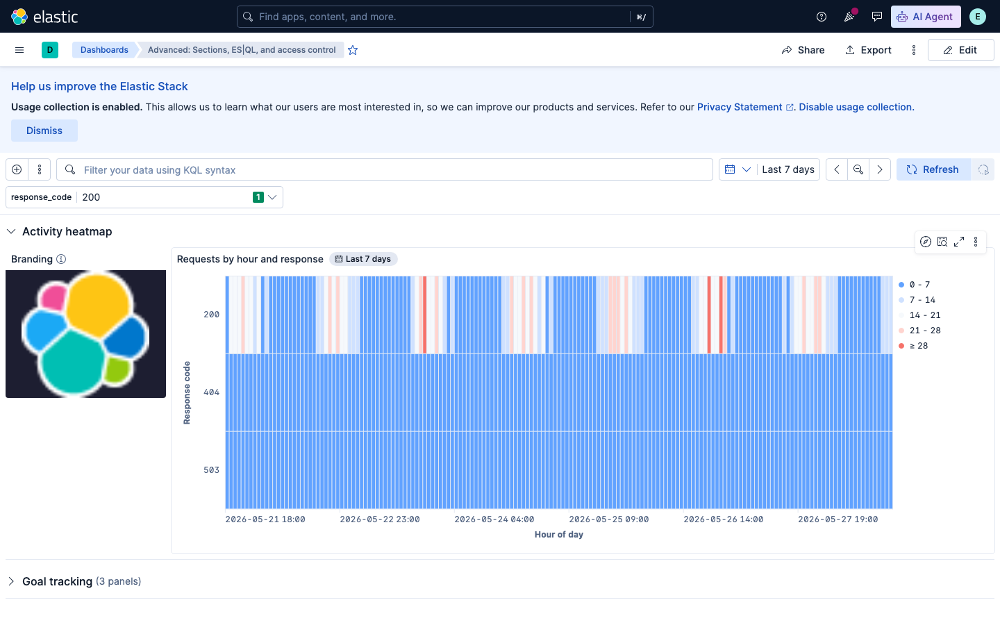
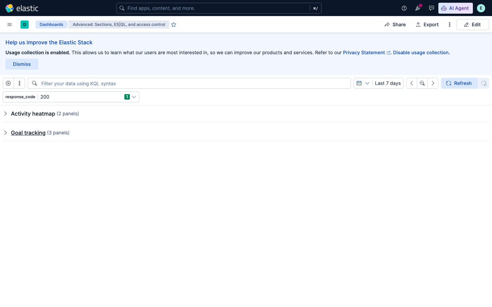
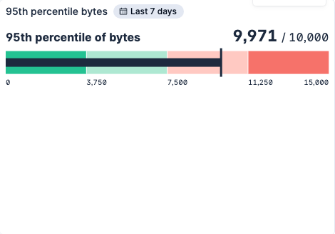
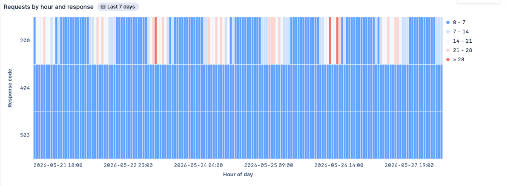

# Advanced Kibana dashboard patterns

This guide covers **production-style** patterns for [`elasticstack_kibana_dashboard`](/docs/resources/kibana_dashboard): collapsible **sections**, a branding **image** panel, Lens **gauge** and **heatmap** charts, a multi-layer **area + line** chart, an **ES|QL** pinned control that drives panel queries, optional **write-restricted** access control, and **tags** for organisation in the Kibana UI.

If you are new to the resource, start with [**Getting started with Kibana dashboards**](/docs/guides/kibana-dashboard-getting-started) (dashboard shell, grid, Lens export workflow) and [**Dashboard operations**](/docs/guides/kibana-dashboard-operations) (pinned **options list** controls and Discover sessions).

The runnable example lives at [`examples/guides/guide3-advanced/main.tf`](https://github.com/elastic/terraform-provider-elasticstack/tree/main/examples/guides/guide3-advanced/main.tf).

## Prerequisites

### Provider setup

Configure the Elasticstack provider with a Kibana connection:

```terraform
terraform {
  required_providers {
    elasticstack = {
      source = "elastic/elasticstack"
    }
  }
}

provider "elasticstack" {
  kibana {}
}
```

See the [provider documentation](/docs/index) for authentication options.

### Kibana version

These examples were tested against **Kibana 9.4+**. **Sections** and some Lens chart types evolved in recent releases; re-export panel JSON from the UI after upgrades if panels fail to render.

### Install sample web logs

This dashboard uses **`kibana_sample_data_logs`** (same dataset as the getting-started guide):

1. Open Kibana and go to the home page (or **Stack Management** → **Data** → **Sample Data**).
2. Under **Sample data sets**, find **Sample web logs** and click **Add data**.
3. Wait until Kibana reports the dataset as installed.

Field names used below include `@timestamp`, `bytes`, `response`, and `response.keyword`.

## What you will build

The finished dashboard includes:

- Two **collapsible sections** — **Activity heatmap** (expanded) and **Goal tracking** (collapsed by default)
- A pinned **ES|QL** control for HTTP response code, filtering an ES|QL **Data Table** panel
- An **image** panel for branding, a **heatmap** of requests by hour and response code, a **gauge** with a static goal, and a dual-axis **area + line** chart
- **Tags** for filtering in the Kibana dashboard library
- An optional **`access_control`** block (commented out in the committed example — see [Access control](#access-control))

Apply each section incrementally, or use the [complete configuration](#complete-configuration) at the end.

## Dashboard shell

Start with title, time range, tags, and empty panel lists. Content panels live in **`sections`** rather than top-level **`panels`** for this guide:

```terraform
resource "elasticstack_kibana_dashboard" "advanced" {
  title       = "Advanced: Sections, ES|QL, and access control"
  description = "Production-style dashboard with collapsible sections, ES|QL controls, gauge goals, heatmaps, and write-restricted access."

  time_range = {
    from = "now-7d"
    to   = "now"
  }

  refresh_interval = {
    pause = true
    value = 0
  }

  query = {
    language = "kql"
    text     = ""
  }

  tags = ["advanced", "production"]

  pinned_panels = []
  sections      = []
  panels        = []
}
```

Reuse the sample logs data view across Lens panels:

```terraform
locals {
  logs_data_source = jsonencode({
    type          = "data_view_spec"
    index_pattern = "kibana_sample_data_logs"
    time_field    = "@timestamp"
  })

  logs_date_histogram_x = jsonencode({
    operation               = "date_histogram"
    field                   = "@timestamp"
    suggested_interval      = "auto"
    use_original_time_range = false
    include_empty_rows      = true
    drop_partial_intervals  = false
  })
}
```

## Collapsible sections

**Sections** group panels into titled blocks that users can **collapse** or **expand** in Kibana. Each section has its own vertical position on the dashboard grid (`sections[].grid.y`) and an inner 48-column grid for its `panels`, independent of other sections.

> **Technical preview** — The dashboard **sections** feature is currently in **technical preview** in Kibana. Behaviour and API shapes may change in future releases. See [Organize dashboard panels](https://www.elastic.co/docs/explore-analyze/dashboards/arrange-panels) for how sections work in the UI, and check [Kibana release notes](https://www.elastic.co/docs/release-notes/kibana) for the current feature status before relying on sections in production.

Define two sections — one expanded, one collapsed by default:

```terraform
sections = [
  {
    title     = "Activity heatmap"
    collapsed = false
    grid = {
      y = 0
    }
    panels = [
      # image + heatmap panels (see following sections)
    ]
  },
  {
    title     = "Goal tracking"
    collapsed = true
    grid = {
      y = 18
    }
    panels = [
      # gauge, multi-layer chart, ES|QL table (see following sections)
    ]
  },
]
```

- **`title`** — Section heading shown in the Kibana UI.
- **`collapsed`** — When `true`, the section starts collapsed; only the header is visible until the user expands it. Collapsed sections can improve initial load time because Kibana defers loading some panel content until expansion (see upstream docs).
- **`grid.y`** — Row offset of the **section block** on the outer dashboard layout. Increase `y` so the second section sits below the first section's panels.





## Image panel (branding)

Add a compact **image** panel for logos or headers. The committed example loads a favicon from a public URL via **`image_config.src.url`**:

```terraform
{
  type = "image"
  grid = { x = 0, y = 0, w = 8, h = 8 }
  image_config = {
    src = {
      url = {
        url = "https://www.elastic.co/favicon.ico"
      }
    }
    alt_text         = "Elastic logo"
    object_fit       = "contain"
    background_color = "#1d1e31"
    title            = "Branding"
    description      = "Static logo for dashboard branding"
    hide_title       = false
    hide_border      = true
  }
},
```

| Field | Role |
| --- | --- |
| **`src.url.url`** | HTTP(S) URL of the image asset (good for branding hosted on a CDN or static site). |
| **`alt_text`** | Accessibility text for screen readers. |
| **`background_color`** | Panel background behind the image (hex color). |
| **`hide_border`** | Removes the default panel chrome when `true`. |
| **`object_fit`** | How the image scales inside the tile (`contain`, `cover`, `fill`, and so on). |

Kibana also supports **`src.file_id`** for images uploaded to Kibana's file library. That path requires uploading the file separately (UI or API) and referencing the returned ID — see the [`image_config` schema](/docs/resources/kibana_dashboard#nestedatt--sections--panels--image_config) in the resource reference.

Place this panel in the first section's `panels` list before the heatmap.

## Gauge chart with a goal

Lens **gauge** panels use `vis_config.by_value.gauge_config`. The metric is a JSON operation string; include a **`goal`** block inside `metric_json` to show progress toward a target.

This example charts the **95th percentile of `bytes`** with a **static goal of 10,000 bytes**:

```terraform
{
  type = "vis"
  grid = { x = 0, y = 0, w = 16, h = 12 }
  vis_config = {
    by_value = {
      gauge_config = {
        title            = "95th percentile bytes"
        data_source_json = local.logs_data_source
        query = {
          language   = "kql"
          expression = ""
        }
        metric_json = jsonencode({
          operation  = "percentile"
          field      = "bytes"
          percentile = 95
          goal = {
            operation = "static_value"
            value     = 10000
          }
        })
        styling = {
          shape_json = jsonencode({
            type        = "bullet"
            orientation = "horizontal"
          })
        }
        ignore_global_filters = false
        sampling              = 1
      }
    }
  }
},
```

- **`goal.operation = "static_value"`** — Fixed numeric target (not derived from another aggregation).
- **`goal.value`** — Goal magnitude in the same units as the metric (here, bytes).

Export gauge `metric_json` and `shape_json` from Lens **Inspect → Request → Response** like other chart types. Add this panel to the **Goal tracking** section.



### Multi-layer area and line chart

In the same section, a **`xy_chart_config`** with two **`layers`** combines a **sum of bytes** (area, left Y axis) and **request count** (line, right Y axis `y2`). Both layers share `local.logs_date_histogram_x` on the X axis. This pattern is the same as line charts in the getting-started guide, but with multiple layers and a secondary axis — see the complete configuration for the full `layers` block.

## Heatmap chart

Lens **heatmap** panels use `vis_config.by_value.heatmap_config`. The committed chart shows **request volume** across **hour of day** (X) and **HTTP response code** (Y) — not day-of-week × hour.

```terraform
{
  type = "vis"
  grid = { x = 8, y = 0, w = 40, h = 16 }
  vis_config = {
    by_value = {
      heatmap_config = {
        title            = "Requests by hour and response"
        data_source_json = local.logs_data_source
        query = {
          language   = "kql"
          expression = ""
        }
        metric_json = jsonencode({
          operation = "count"
        })
        x_axis_json = jsonencode({
          operation               = "date_histogram"
          field                   = "@timestamp"
          suggested_interval      = "1h"
          include_empty_rows      = true
          drop_partial_intervals  = false
          use_original_time_range = false
        })
        y_axis_json = jsonencode({
          operation = "terms"
          fields    = ["response.keyword"]
          limit     = 8
          rank_by = {
            type         = "metric"
            metric_index = 0
            direction    = "desc"
          }
        })
        axis = {
          x = {
            labels = {
              orientation = "horizontal"
              visible     = true
            }
            title = {
              value   = "Hour of day"
              visible = true
            }
          }
          y = {
            labels = {
              visible = true
            }
            title = {
              value   = "Response code"
              visible = true
            }
          }
        }
        styling = {
          cells = {
            labels = {
              visible = false
            }
          }
        }
        legend = {
          visibility           = "visible"
          size                 = "m"
          truncate_after_lines = 5
        }
        ignore_global_filters = false
        sampling              = 1
      }
    }
  }
},
```

- **`x_axis_json`** — `date_histogram` on `@timestamp` with **`suggested_interval = "1h"`** buckets requests into hours within the dashboard time range (axis title: **Hour of day**).
- **`y_axis_json`** — `terms` on **`response.keyword`** splits rows by HTTP status (200, 404, 503, …).
- **`metric_json`** — Cell color intensity from **`count`**.

A **day-of-week × hour** heatmap would need an extra field (for example a runtime field or scripted transform to extract weekday). That is outside this guide; the pattern above matches what the example actually renders.



## ES|QL control and variable queries

**ES|QL controls** live in **`pinned_panels`** (like options list controls in the operations guide). They declare a **named variable** that other panels reference with **`?variable_name`** syntax in ES|QL queries.

Add a single-select control over distinct `response` values:

```terraform
pinned_panels = [
  {
    type = "esql_control"
    esql_control_config = {
      control_type     = "STATIC_VALUES"
      variable_name    = "response_code"
      variable_type    = "values"
      esql_query       = "FROM kibana_sample_data_logs | STATS BY response"
      selected_options = ["200"]
      available_options = [
        "200",
        "404",
        "503",
      ]
      title         = "HTTP response"
      single_select = true
      display_settings = {
        placeholder = "Select response code..."
      }
    }
  },
]
```

| Field | Role |
| --- | --- |
| **`variable_name`** | Name bound in dependent queries (`response_code` → `?response_code`). |
| **`variable_type = "values"`** | Control supplies discrete values (not a time range). |
| **`esql_query`** | ES|QL that populates the control's choices (`STATS BY response`). |
| **`selected_options`** | Default selection on first load (`["200"]`). |
| **`single_select`** | One value at a time when `true`. |

Wire a **Lens ES|QL Data Table** in the **Goal tracking** section that filters on the control:

```terraform
{
  type = "vis"
  grid = { x = 0, y = 12, w = 48, h = 10 }
  vis_config = {
    by_value = {
      datatable_config = {
        esql = {
          title = "Requests for selected response"
          data_source_json = jsonencode({
            type  = "esql"
            query = "FROM kibana_sample_data_logs | WHERE response == ?response_code | STATS requests = COUNT(*)"
          })
          styling = {
            density = {
              mode = "default"
            }
          }
          metrics = [{
            config_json = jsonencode({
              operation = "value"
              column    = "requests"
            })
          }]
          ignore_global_filters = false
          sampling              = 1
        }
      }
    }
  }
},
```

When a user picks **404** in the pinned control, the table re-runs with `?response_code` bound to `404`. Options list controls filter KQL/Lucene-backed Lens panels; **ES|QL controls** are the right tool when the panel query is pure ES|QL.

## Access control

**`access_control`** limits who can edit a dashboard in Kibana. The provider maps **`access_mode`** to Kibana's dashboard access API.

```terraform
access_control = {
  access_mode = "write_restricted"
}
```

| Value | Meaning |
| --- | --- |
| **`write_restricted`** | Only users granted edit rights (per Kibana's access rules for that dashboard) can change layout and panel config. Others can still view if they have read access. |
| **`default`** | Standard dashboard editing for users with sufficient Kibana privileges. |

**Changing `access_mode` forces replacement** of the `elasticstack_kibana_dashboard` resource (Terraform destroys and recreates the dashboard). Plan dashboard IDs, bookmarks, and embedded links accordingly when toggling access modes.

### Bootstrap user caveat (read this before uncommenting)

The committed example **keeps `access_control` commented out** on purpose. Kibana rejects creating dashboards with **`access_mode` set** when Terraform authenticates as the default **`elastic` bootstrap superuser**, because that account is not tied to a **Kibana user profile**. You will see API errors if you uncomment the block while still using bootstrap credentials.

**Workflow to enable write-restricted access:**

1. **Create a normal Kibana user** with a profile — for example `elasticstack_elasticsearch_security_user` with roles such as `kibana_admin`, or an internal user provisioned outside Terraform.
2. **Log in to Kibana once** as that user so Kibana creates the user profile (or confirm the profile exists under **Stack Management** → **Users**).
3. **Point the provider at that user** — set `username` / `password` (or API key) on the `elasticstack` provider `kibana` and `elasticsearch` blocks, or use a `provider` alias as in the provider's access-control acceptance test.
4. **Uncomment `access_control`** in your Terraform and run `terraform apply`.

The provider's acceptance test for this behaviour lives at [`internal/kibana/dashboard/testdata/TestAccResourceDashboardAccessControl/basic`](https://github.com/elastic/terraform-provider-elasticstack/tree/main/internal/kibana/dashboard/testdata/TestAccResourceDashboardAccessControl/basic) — it applies the dashboard through a dedicated provider alias authenticated as a non-bootstrap user.

For Kibana-side behaviour of dashboard permissions, see [Kibana privileges](https://www.elastic.co/docs/deploy-manage/users-roles/cluster-or-deployment-auth/kibana-privileges) and the Dashboard feature privileges your roles grant.

## Tags

**`tags`** attach Saved Object tags so operators can filter dashboards in the Kibana UI (library search, tag filters). The schema accepts **tag IDs**; the example uses human-readable strings that Kibana resolves by tag name:

```terraform
tags = ["advanced", "production"]
```

Tags are stored in Kibana's Saved Objects layer. IDs are typically UUIDs when created in the UI; **string names work** when they match existing tag labels in the space. For repeatable infrastructure across environments, create tags consistently (Kibana UI, [Saved Objects API](https://www.elastic.co/docs/api/doc/kibana/group/endpoint-saved-objects), or your organisation's tagging automation) and reference the same IDs in Terraform.

The provider does not yet ship a dedicated `elasticstack_kibana_tag` resource; manage tag lifecycle through Kibana or the API, then reference tag IDs on the dashboard resource.

## Complete configuration

Apply the full dashboard — both sections, all panels, pinned ES|QL control, and commented `access_control`:

```terraform
terraform {
  required_providers {
    elasticstack = {
      source = "elastic/elasticstack"
    }
  }
}

provider "elasticstack" {
  kibana {}
}

locals {
  logs_data_source = jsonencode({
    type          = "data_view_spec"
    index_pattern = "kibana_sample_data_logs"
    time_field    = "@timestamp"
  })

  logs_date_histogram_x = jsonencode({
    operation               = "date_histogram"
    field                   = "@timestamp"
    suggested_interval      = "auto"
    use_original_time_range = false
    include_empty_rows      = true
    drop_partial_intervals  = false
  })
}

resource "elasticstack_kibana_dashboard" "advanced" {
  title       = "Advanced: Sections, ES|QL, and access control"
  description = "Production-style dashboard with collapsible sections, ES|QL controls, gauge goals, heatmaps, and write-restricted access."

  time_range = {
    from = "now-7d"
    to   = "now"
  }

  refresh_interval = {
    pause = true
    value = 0
  }

  query = {
    language = "kql"
    text     = ""
  }

  tags = ["advanced", "production"]

  # Uncomment with a non-bootstrap Kibana user that has a profile id (see
  # internal/kibana/dashboard/testdata/TestAccResourceDashboardAccessControl/basic).
  # The default elastic superuser cannot create dashboards with access_mode set.
  # access_control = {
  #   access_mode = "write_restricted"
  # }

  pinned_panels = [
    {
      type = "esql_control"
      esql_control_config = {
        control_type     = "STATIC_VALUES"
        variable_name    = "response_code"
        variable_type    = "values"
        esql_query       = "FROM kibana_sample_data_logs | STATS BY response"
        selected_options = ["200"]
        available_options = [
          "200",
          "404",
          "503",
        ]
        title         = "HTTP response"
        single_select = true
        display_settings = {
          placeholder = "Select response code..."
        }
      }
    },
  ]

  sections = [
    {
      title     = "Activity heatmap"
      collapsed = false
      grid = {
        y = 0
      }
      panels = [
        {
          type = "image"
          grid = { x = 0, y = 0, w = 8, h = 8 }
          image_config = {
            src = {
              url = {
                url = "https://www.elastic.co/favicon.ico"
              }
            }
            alt_text         = "Elastic logo"
            object_fit       = "contain"
            background_color = "#1d1e31"
            title            = "Branding"
            description      = "Static logo for dashboard branding"
            hide_title       = false
            hide_border      = true
          }
        },
        {
          type = "vis"
          grid = { x = 8, y = 0, w = 40, h = 16 }
          vis_config = {
            by_value = {
              heatmap_config = {
                title            = "Requests by hour and response"
                data_source_json = local.logs_data_source
                query = {
                  language   = "kql"
                  expression = ""
                }
                metric_json = jsonencode({
                  operation = "count"
                })
                x_axis_json = jsonencode({
                  operation               = "date_histogram"
                  field                   = "@timestamp"
                  suggested_interval      = "1h"
                  include_empty_rows      = true
                  drop_partial_intervals  = false
                  use_original_time_range = false
                })
                y_axis_json = jsonencode({
                  operation = "terms"
                  fields    = ["response.keyword"]
                  limit     = 8
                  rank_by = {
                    type         = "metric"
                    metric_index = 0
                    direction    = "desc"
                  }
                })
                axis = {
                  x = {
                    labels = {
                      orientation = "horizontal"
                      visible     = true
                    }
                    title = {
                      value   = "Hour of day"
                      visible = true
                    }
                  }
                  y = {
                    labels = {
                      visible = true
                    }
                    title = {
                      value   = "Response code"
                      visible = true
                    }
                  }
                }
                styling = {
                  cells = {
                    labels = {
                      visible = false
                    }
                  }
                }
                legend = {
                  visibility           = "visible"
                  size                 = "m"
                  truncate_after_lines = 5
                }
                ignore_global_filters = false
                sampling              = 1
              }
            }
          }
        },
      ]
    },
    {
      title     = "Goal tracking"
      collapsed = true
      grid = {
        y = 18
      }
      panels = [
        {
          type = "vis"
          grid = { x = 0, y = 0, w = 16, h = 12 }
          vis_config = {
            by_value = {
              gauge_config = {
                title            = "95th percentile bytes"
                data_source_json = local.logs_data_source
                query = {
                  language   = "kql"
                  expression = ""
                }
                metric_json = jsonencode({
                  operation  = "percentile"
                  field      = "bytes"
                  percentile = 95
                  goal = {
                    operation = "static_value"
                    value     = 10000
                  }
                })
                styling = {
                  shape_json = jsonencode({
                    type        = "bullet"
                    orientation = "horizontal"
                  })
                }
                ignore_global_filters = false
                sampling              = 1
              }
            }
          }
        },
        {
          type = "vis"
          grid = { x = 16, y = 0, w = 32, h = 12 }
          vis_config = {
            by_value = {
              xy_chart_config = {
                title = "Bytes sent and request volume"
                axis = {
                  y = {
                    domain_json = jsonencode({ type = "fit" })
                    title       = { value = "Bytes", visible = true }
                  }
                  y2 = {
                    domain_json = jsonencode({ type = "fit" })
                    title       = { value = "Requests", visible = true }
                  }
                  x = {
                    title = { value = "@timestamp", visible = true }
                  }
                }
                decorations = {}
                fitting     = { type = "none" }
                legend = {
                  visibility = "visible"
                  position   = "right"
                  size       = "m"
                  inside     = false
                }
                query = { expression = "" }
                layers = [
                  {
                    type = "area"
                    data_layer = {
                      data_source_json = local.logs_data_source
                      x_json           = local.logs_date_histogram_x
                      y = [{
                        config_json = jsonencode({
                          operation     = "sum"
                          field         = "bytes"
                          empty_as_null = true
                        })
                      }]
                    }
                  },
                  {
                    type = "line"
                    data_layer = {
                      data_source_json = local.logs_data_source
                      x_json           = local.logs_date_histogram_x
                      y = [{
                        config_json = jsonencode({
                          operation     = "count"
                          empty_as_null = true
                          axis          = "y2"
                        })
                      }]
                    }
                  },
                ]
              }
            }
          }
        },
        {
          type = "vis"
          grid = { x = 0, y = 12, w = 48, h = 10 }
          vis_config = {
            by_value = {
              datatable_config = {
                esql = {
                  title = "Requests for selected response"
                  data_source_json = jsonencode({
                    type  = "esql"
                    query = "FROM kibana_sample_data_logs | WHERE response == ?response_code | STATS requests = COUNT(*)"
                  })
                  styling = {
                    density = {
                      mode = "default"
                    }
                  }
                  metrics = [{
                    config_json = jsonencode({
                      operation = "value"
                      column    = "requests"
                    })
                  }]
                  ignore_global_filters = false
                  sampling              = 1
                }
              }
            }
          }
        },
      ]
    },
  ]

  panels = []
}
```

To try **write-restricted** mode, follow the [bootstrap user caveat](#bootstrap-user-caveat-read-this-before-uncommenting) workflow, then uncomment the `access_control` block in your copy of the config.

## Next steps

You now have a production-oriented dashboard pattern with sections, ES|QL controls, and optional access restrictions. Review the rest of the series:

- [**Getting started with Kibana dashboards**](/docs/guides/kibana-dashboard-getting-started) — first-time walkthrough on sample web logs (markdown, metrics, line, bar, and donut panels).
- [**Dashboard operations**](/docs/guides/kibana-dashboard-operations) — pinned **options list** controls, KPI rows, charts, and an embedded **Discover** session on sample eCommerce data.

For every attribute and panel type, see the [`elasticstack_kibana_dashboard` resource reference](/docs/resources/kibana_dashboard). Regenerate screenshots after UI or config changes with `node scripts/screenshots/guide3.mjs` (see [`scripts/screenshots/README.md`](https://github.com/elastic/terraform-provider-elasticstack/tree/main/scripts/screenshots/README.md)).
